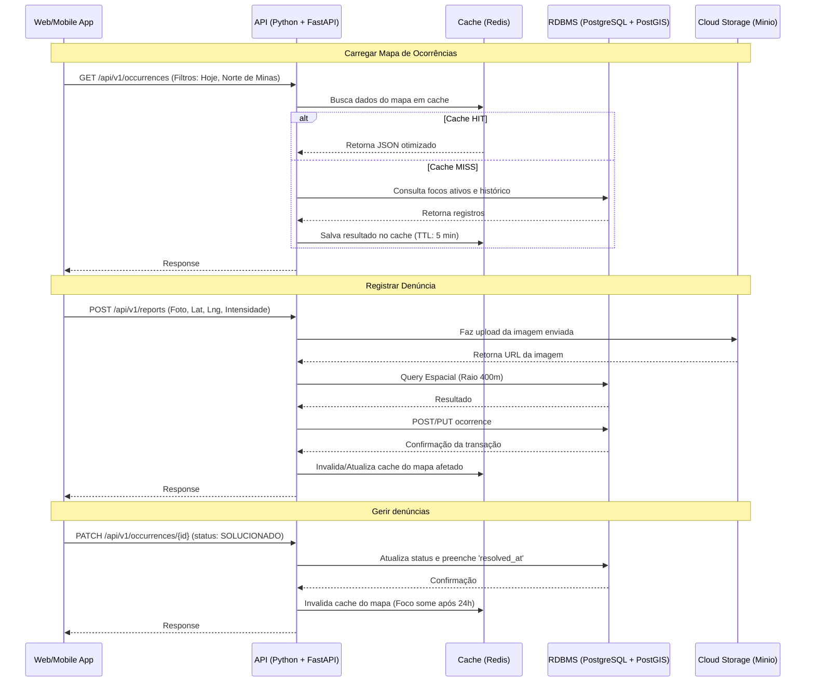

# Arquitetura e Serviços

A arquitetura proposta é baseada em microsserviços lógicos (ou um Monolito Modular) com separação clara de responsabilidades. Utilizaremos um serviço de cache para otimizar a leitura do mapa.

