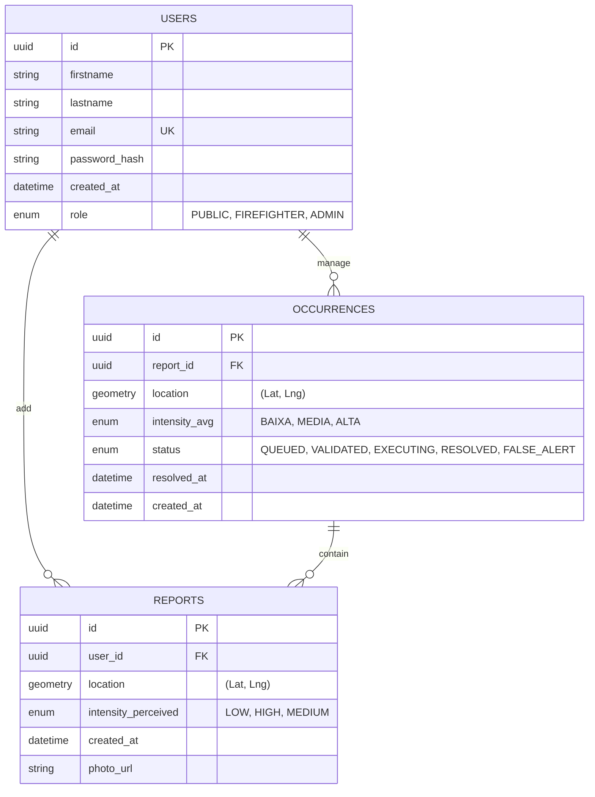

# Entidades do Banco de Dados

- Usuários (USERS)
- Ocorrências (OCCURRENCES)
- Denúncias (REPORTS)

### Schema

```mermaid

erDiagram

    USERS {
        uuid id PK
        string firstname
        string lastname
        string email UK
        string password_hash
        datetime created_at
        enum role "PUBLIC, FIREFIGHTER, ADMIN"

    }

    OCCURRENCES {
        uuid id PK
        uuid report_id FK
        geometry location "(Lat, Lng)"
        enum intensity_avg "BAIXA, MEDIA, ALTA"
        enum status "QUEUED, VALIDATED, EXECUTING, RESOLVED, FALSE_ALERT"
        datetime resolved_at
        datetime created_at
    }

    REPORTS {
        uuid id PK
        uuid user_id FK
        geometry location "(Lat, Lng)"
        enum intensity_perceived "LOW, HIGH, MEDIUM"
        datetime created_at
        string photo_url
    }

    %% Relacionamentos
    USERS ||--o{ REPORTS : "add"
    USERS ||--o{ OCCURRENCES : "manage"
    OCCURRENCES ||--o{ REPORTS : "contain"

```
